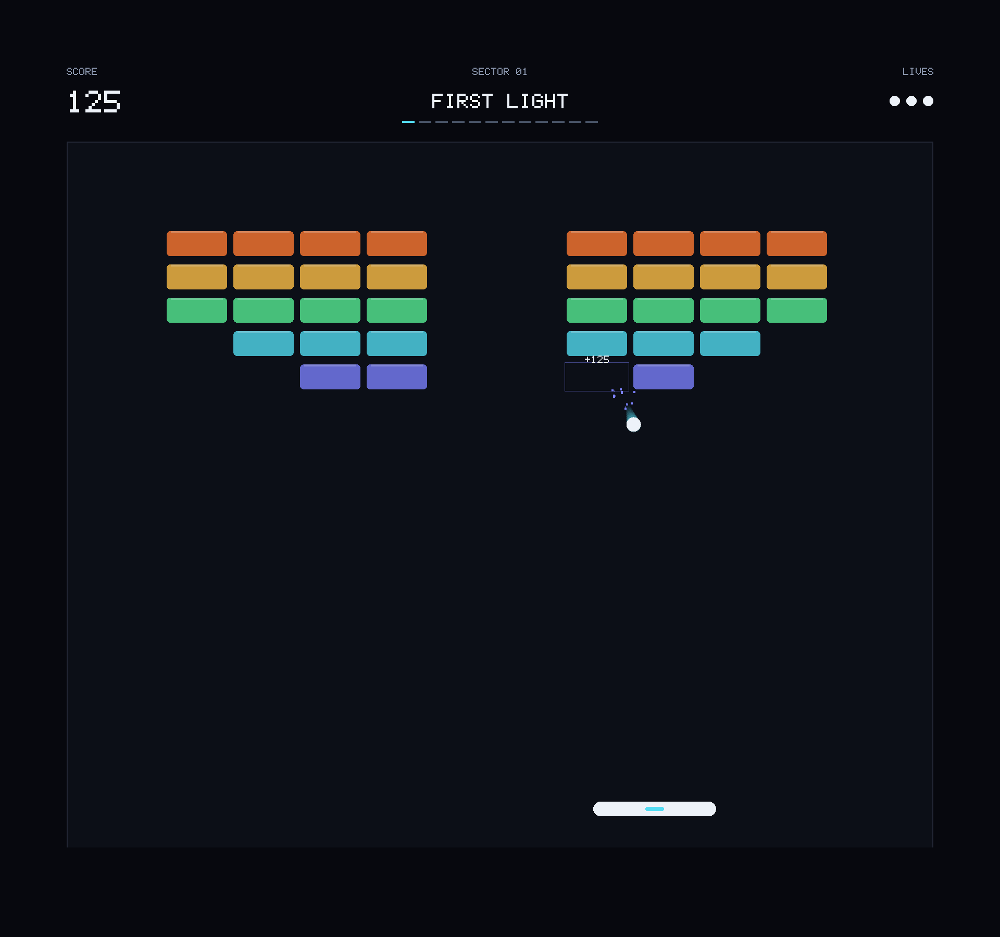

# ARKONK

A small, precise brick breaker in Rust. Twelve authored sectors across three
chapters, saved checkpoints, replayable sectors, and 36 medals to earn at your own
pace. Direct mouse control, 240 Hz collision simulation, and restrained feedback
keep the focus on the next bounce.

The presentation is flat and quiet: rounded bricks, a pill paddle, an original
5×7 pixel typeface, and a dark field. Each chapter has its own palette. The HUD
shows only the score, the sector with a progress strip, and remaining lives.
[Start screen](docs/attract.png) · [Sector map](docs/sectors.png)



## Play

Install stable Rust (1.88 or newer), then:

```sh
git clone https://github.com/oddurs/arkonk.git
cd arkonk
cargo run --locked --release
```

For a native macOS app launch:

```sh
./scripts/build-macos.sh
open target/ARKONK.app
```

This builds a local app bundle with a development signature and
[Game Mode support](https://developer.apple.com/documentation/bundleresources/information-property-list/lssupportsgamemode)
metadata. Distribution signing/notarization remains release work. The bundle is
built for the current Mac architecture.

No downloaded assets or working-directory-dependent resource files are needed.
The original 5×7 pixel alphabet is packed into an atlas at startup; artwork is
drawn with native geometry, and sounds are synthesized and decoded once.
Native macOS is verified locally. Windows and Linux have CI build coverage.
On Linux, install the native libraries first (Debian/Ubuntu):

```sh
sudo apt-get install libasound2-dev libx11-dev libxi-dev libgl1-mesa-dev
```

| Control | Action |
| --- | --- |
| Mouse / A, D / Left, Right | Move paddle |
| Space / Enter / Left click | Select a menu action or serve |
| P / Escape | Pause or resume |
| Arrows / W, S | Navigate menus |
| R in pause / results | Retry from the sector checkpoint |
| Escape in sector select / results | Main menu |
| M | Mute sound |
| [ / ] | Lower / raise volume |
| F | Toggle fullscreen |
| F3 | Performance overlay |
| Q / Close window | Quit |

Keyboard input takes control until the mouse moves again. Hit the ball with the
paddle's edges to steer it; a centered hit sends it straight up. Catch falling
capsules:

| Capsule | Effect |
| --- | --- |
| **W — Wide** | A wider paddle for 14 seconds. |
| **S — Slow** | Slower balls for 12 seconds. |
| **M — Multi** | Split into up to three balls. |
| **A — Anchor** | Three sticky catches. Reposition, then click or press Space to release. |
| **P — Phase** | Each ball passes through its next three brick contacts, damaging each. |

Anchor holds one ball at a time while the others keep moving. It has no release
timer; the sector clock keeps running. Powers combine: a held ball keeps its
Phase contacts, and Multi can launch two balls while the original stays held.
Wide/Slow have small timer lines under the paddle, Anchor has three charge pips,
and Phase has three marks beneath each ball. A life is lost only when the last
active ball drains.

Amber diamond **relay cores** damage their four adjacent bricks when destroyed.
Connected cores chain in short, staggered pulses; armored bricks absorb one hit
per pulse. Committed chains finish even if the last ball drains, so a final
explosion can still clear the sector. Chain damage cannot spawn a shower of capsules.

Each sector introduces a chosen opening capsule after two direct brick breaks;
later drops have a bounded dry spell and unlock gradually across the journey.
The layouts progress from isolated cores to branching chains and armored pockets.
If the last two bricks have stalled a single-ball rally for twelve seconds, one
Anchor catch becomes available to aim the finish. Ball speed rises gently through
a rally, and rare angle corrections prevent flat or perfectly vertical stalls.
Leaving the window pauses play automatically. The paddle's cyan center mark is
the straight-up spot.

[Anchor with combined powers](docs/anchor.png) · [Relay ignition](docs/relay.png)

## Your journey

**Daybreak**, **Blue Hour**, and **Afterlight** each contain four distinct layouts.
Clear a sector to unlock the next and stop at a results screen before continuing.
Each chapter awards an extra life, up to five. Three medals track each sector:

- **Clear:** finish the layout.
- **Clean:** finish without losing a life.
- **Swift:** finish within its target time; only active play counts.

A clear awards 1,000 points, with 500 each for Clean and Swift. Consecutive brick
breaks before a paddle bounce increase the chain bonus and subtly raise the hit
sound's pitch. Personal best times and medals persist across attempts.

**Continue Journey** restores the start of your saved sector, including score and
lives. Quitting mid-sector or choosing Retry returns to that checkpoint; partial
sector scores are not carried into retries. **Sector Select** lets you practice
unlocked layouts and improve medals without replacing your journey checkpoint or
journey high score. New Journey replaces the current checkpoint while keeping
unlocks, medals, times, and the personal best.

The playfield keeps its proportions when resized. Progress and settings live under
`~/Library/Application Support/arkonk` on macOS, `%LOCALAPPDATA%/arkonk` on Windows,
or `$XDG_DATA_HOME/arkonk` (falling back to `~/.local/share/arkonk`) on Linux.
The versioned `progress.txt` is written through a temporary file at
menu/sector boundaries; legacy `best.txt` scores are imported automatically.
No account, network connection, or asset download is used during play.

## Presentation

macOS uses native Metal; Windows and Linux use OpenGL. The fixed 960×900 scene
is drawn straight to the window through a letterboxing camera, so shapes render
at native resolution and glyph cells snap to whole physical pixels. One final
full-window draw restores framebuffer alpha after translucent overlays, so no
compositor can show the window through them.

Brick-hit flashes, floating scores, paddle impact lights, and pickup rings use
fixed pools in the renderer. A restart reuses them.

## Performance

- Fixed 240 Hz simulation driven by a monotonic clock, interpolated balls, and
  display-paced presentation. macOS schedules work with CVDisplayLink and keeps
  Metal display synchronization enabled.
- Direct mouse tracking; the paddle renders at its latest position for lower latency.
- At most sixteen catch-up ticks per frame; discarded ticks appear in the overlay.
- Large stalls pause play instead of fast-forwarding into a lost life.
- Continuous circle/rectangle collisions, including exact rounded corners.
- Moving-paddle collisions use relative motion, preserving interception timing.
- A compact 12 × 7 brick grid limits collision tests to cells on the swept path.
- Fixed arrays for three balls, 384 particles, and twelve power-up drops.
- Eight collision resolutions per ball per tick. If exhausted, the ball stays
  at its last safe position; it never advances unchecked through bricks.
- Single-threaded simulation and batched geometry through Macroquad.
- macOS Metal uses two fenced frame slots instead of waiting for GPU completion
  after every submission; vertex, index, and uniform storage are safe to reuse.
- Foreground macOS input/render work uses interactive thread priority; background
  windows use utility priority and normal play pauses on focus loss.
- Relay propagation, sticky catches, Phase contacts, and effects use fixed arrays.
- Reused text buffers; no heap allocation in simulation updates.

Run the headless benchmark:

```sh
cargo run --locked --release --bin benchmark
```

Measured on an **Apple M4 Pro, arm64, Rust 1.98.1**, release profile:

| Scenario | Mean / tick | Batch p95 / tick | Batch p99 / tick | Heap allocations |
| --- | ---: | ---: | ---: | ---: |
| Autopaddle gameplay across all twelve sectors | 0.207 µs | 0.254 µs | 0.298 µs | 0 |
| Three balls at 12,000 px/s, full particle/drop pools | 0.446 µs | 0.517 µs | 0.586 µs | 0 |
| 84 connected cores, all five powers, full effects pools | 0.507 µs | 0.585 µs | 0.651 µs | 0 |

Each scenario measures 262,144 ticks in batches of 64. Times include benchmark
control and pool replenishment, but exclude graphics and audio. Percentiles are
of batch averages, not individual ticks. The benchmark asserts zero simulation
allocations, no exhausted collision budgets, actual brick impacts, and coverage
of all twelve sectors. Gameplay batches periodically start a new sector to ensure
coverage without depending on the autopaddle completing the journey. Results vary
by hardware and load.

F3 shows recent frame-time p95/p99, simulation time, CPU draw preparation time,
discarded ticks, and collision-budget counts. Draw timing excludes GPU execution
and presentation. Headless tick timings cannot establish smooth frame pacing.

Use the separate whole-run test for that:

```sh
cargo run --locked --release -- --perf-test --effects-test
```

It warms up for 300 frames and records the next 3,600 frame intervals in a
preallocated buffer. After exiting, it writes `target/frame-times.csv` (or
`arkonk-frame-times.csv` in the system temporary directory for app-bundle launches)
and reports
p95, p99, worst frame, and counts above 16.7, 25, and 50 ms. The stress scene
repeatedly ignites 84 connected cores with all powers and full effect pools.
There are no screenshot writes or window resizes in this measurement. Run with
`--opengl` on macOS to compare backends.
Add `--fullscreen` to measure fullscreen presentation. Keep the window visible
and focused; run graphics comparisons sequentially.
The report counts unfocused frames and retains them in its timings so background
throttling cannot silently produce a misleading foreground comparison.

Use a focused run to assess foreground pacing. Background/space-transition
frames are retained in the trace and flagged; those runs are diagnostic data,
not a foreground performance acceptance result. Metal display synchronization
stays enabled to preserve presentation quality. Validate the feel on the actual
window/fullscreen setup before treating frame pacing as finished.

The released Miniquad Metal path needed fixes for offscreen attachment formats,
Retina clipping, resizing, and GPU buffer reuse. The narrow, vendored patch and its
limits are documented in [vendor/miniquad/ARKONK.md](vendor/miniquad/ARKONK.md).
Native desktop runtime testing on Windows/Linux, controller support, Steam
integration, and packaging remain release work; CI build coverage is not runtime
or Steam Deck certification.

## Development

```sh
cargo fmt --all -- --check
cargo clippy --locked --all-targets -- -D warnings
cargo test --locked --all-targets
cargo build --locked --release
cargo run --locked --release --bin arkonk -- --smoke-test
cargo run --locked --release --bin arkonk -- --flow-test
```

The smoke test opens a window, launches a ball, follows it with the paddle,
reports frame statistics,
and exits automatically. On OpenGL it also writes `target/smoke-test.png` and
presentation captures. Metal texture readback is not implemented by Miniquad;
use macOS window capture for Metal screenshots. To check Metal correctness, run the smoke/effects and flow tests
with `MTL_DEBUG_LAYER=1 MTL_SHADER_VALIDATION=1`; disable validation for timings.
Both graphical checks need a desktop session and leave your saved progress alone.
`--flow-test` drives the real menu input handlers through new journey, sector clear,
checkpoint restore, practice, focus pause, resume, and retry, with assertions at
transition boundaries. It also checks sticky catches with combined powers,
pause/resume while holding, explicit release, Phase contacts, and relay ignition.
`--effects-test` exercises repeated full-board cascades, full pools, and resizing.

`src/physics.rs` contains context-free geometry; `src/game.rs` contains the pure
fixed-step simulation. `src/levels.rs` authors the journey, `src/profile.rs` persists it, and
`src/timing.rs` schedules ticks. `src/main.rs` handles application transitions; `src/render.rs`,
`src/audio.rs`, and `src/perf.rs` handle presentation, `src/ui.rs` holds menu
layout and input, and `src/pixel_font.rs` contains the original bitmap type.
Collision tests cover high
speed tunneling, rounded corners, departing/parallel trajectories, moving
paddle interception, bounce steering, life loss, powers, and level transitions.
Additional tests cover medals, checkpoint isolation, malformed saves, replacing
save files, drop cadence, anti-stall behavior, and timing at 30–360 Hz.
GitHub Actions runs formatting, Clippy, tests, release builds, and allocation
benchmarks on macOS, Linux, and Windows.

MIT licensed.
